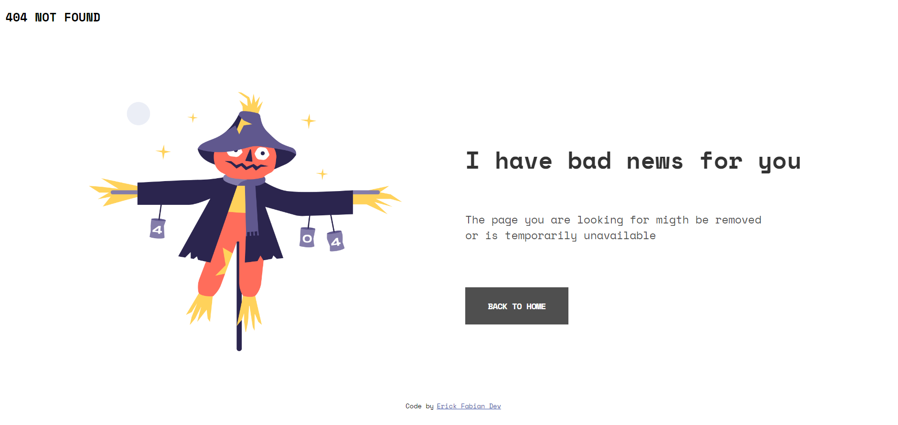
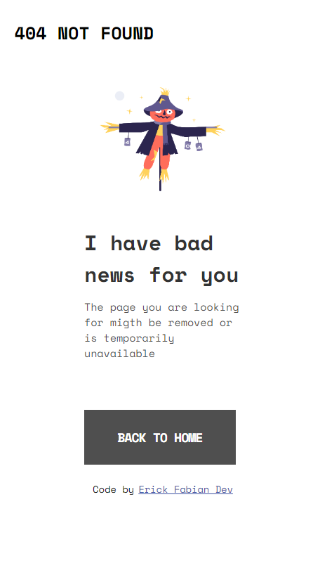

# Make It Real - 404 NOT FOUND PAGE
This is a solution to the 404 Not found Page project of the Make It Real course.

## Table of contents

- [Overview](#overview)
  - [The challenge](#the-challenge)
  - [Screenshot](#screenshot)
- [My process](#my-process)
  - [Built with](#built-with)
  - [What I learned](#what-i-learned)
  - [Continued development](#continued-development)
  - [Useful resources](#useful-resources)
- [Author](#author)
- [Acknowledgments](#acknowledgments)

## Overview
This is a small project that utilizes Flexbox to create a responsive layout in HTML and CSS. In this project, we leverage the capabilities of Flexbox to design and position elements in a flexible and adaptable manner for different devices and screen sizes.

### The Challenge
The challenge was to create a responsive layout using Flexbox CSS to achieve a flexible and adaptable arrangement of elements. The goal was to create a design that automatically adjusts to different screen sizes and provides a consistent user experience on both mobile and desktop devices.

### Screenshot
Here is a screenshot of the project, showcasing the responsive design and the elements arranged using Flexbox CSS.

***web size - 1440px***  

***mobile size-376px***

## My Process
I started by creating the basic structure of the project using HTML.
Next, I applied styles using CSS, making use of Flexbox to position and distribute the elements within the layout.
I performed testing on different screen sizes and made necessary adjustments to achieve a responsive and adaptable design.

### Built With
* HTML
* CSS (Flexbox)

### What I Learned
Throughout this project, I learned how to utilize Flexbox CSS to create flexible and responsive layouts. I gained experience in using Flexbox properties and values such as display: flex, flex-direction, justify-content, align-items, among others.

### Continued Development
While this project is on a small scale, I plan to continue exploring and learning more about Flexbox and other responsive design techniques. I will also seek to implement additional functionalities and improve the visual appearance of elements in future projects.

### Useful Resources
Here are some resources I found helpful while working on this project:

* [CSS-Tricks Flexbox Guide](https://css-tricks.com/snippets/css/a-guide-to-flexbox/)
* [MDN Web Docs - Flexbox](https://developer.mozilla.org/en-US/docs/Learn/CSS/CSS_layout/Flexbox)

## Author
This project was created by Erick Fabian. 
You can reach me at [erickfabiandev.com](https://www.erickfabiandev.com/) for any inquiries or feedback.

## Acknowledgments
Thanks to Juan Villegas, my partner in this project.

