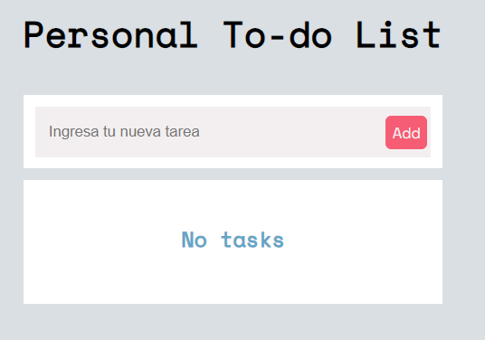
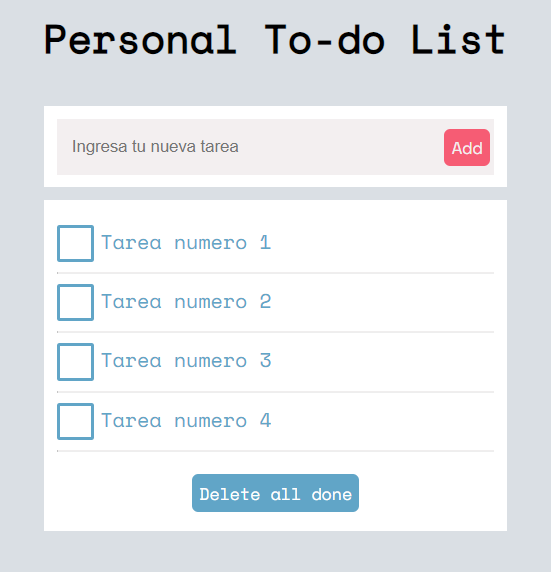
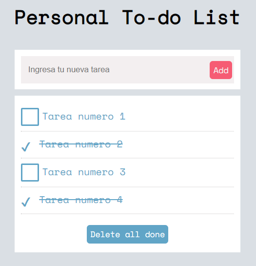
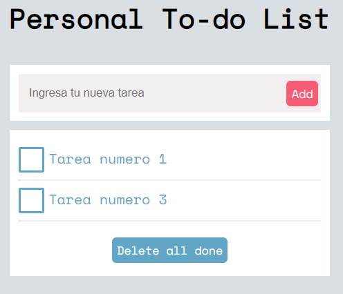

# Project Task List: Javascript Vanilla
Program an application to carry out the control of tasks to be carried out.
A To-do List that has the following structure

## Table of contents

- [Overview](#overview)
  - [The challenge](#the-challenge)
  - [Screenshot](#screenshot)
- [My process](#my-process)
  - [Built with](#built-with)
  - [What I learned](#what-i-learned)
  - [Continued development](#continued-development)
  - [Useful resources](#useful-resources)
- [Author](#author)

## Overview
In this project, I have created a To-Do List using CSS pseudo-elements and DOM manipulation with vanilla JavaScript. The main goal was to build an application that allows users to add tasks to a list and mark them as completed when needed.

### The Challenge
The challenge involved implementing the following functionalities:

Allowing the user to add new tasks to the list.
Allowing the user to mark tasks as completed.
Allowing the user to delete tasks from the list.

### Screenshot
Here is a screenshot of the project's interface:

***1.-Initial view of the project***  

***2.- View with added tasks***

***3.- View with tasks marked as completed***

***4.- View with tasks that are still pending***

## My Process
In my approach to this project, I followed these steps:

Structured the basic HTML for the task list.
Used CSS to design and style the interface of the To-Do List, including the use of pseudo-elements for list items.
Used vanilla JavaScript to manipulate the DOM and add the necessary functionality, such as adding and deleting tasks, and marking them as completed.

### Built With
This project was built using the following technologies:

* HTML
* CSS
* JavaScript

### What I Learned
During this project, I learned how to use pseudo-elements in CSS to style specific elements of the task list. I also gained experience in manipulating the DOM using vanilla JavaScript and implementing interactive functionalities.

### Continued Development
In the future, I plan to improve this project by implementing additional features, such as the ability to edit existing tasks and add categories or labels to tasks.

### Useful Resources
Here are some helpful resources I used during the development of this project:

* [MDN Documentation on CSS Pseudo-elements](https://developer.mozilla.org/en-US/docs/Web/CSS/Pseudo-elements)
* [MDN Documentation on DOM Manipulation with JavaScript](https://developer.mozilla.org/en-US/docs/Web/API/Document_Object_Model)

## Author
This project was created by Erick Fabian. 
You can reach me at [erickfabiandev.com](https://www.erickfabiandev.com/) for any inquiries or feedback.
