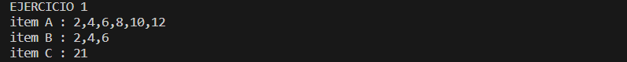
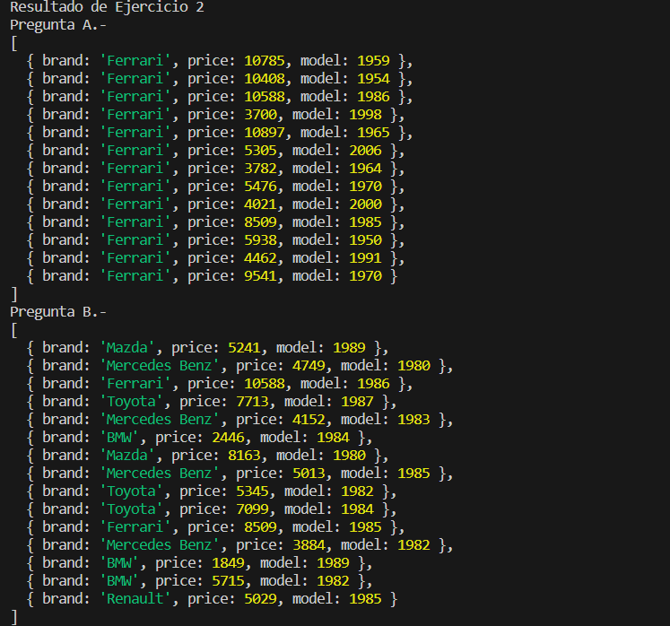
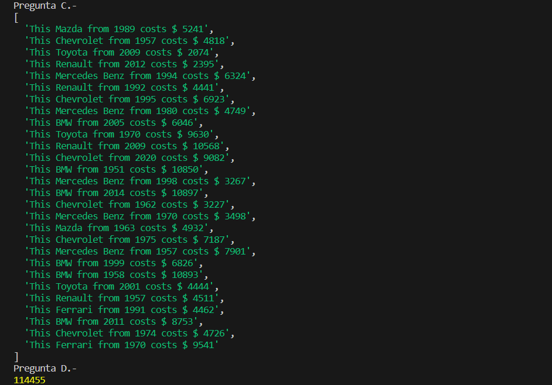

# FUNCTIONAL PROGRAMMING ES6 JAVASCRIPT 

## Overview

This repository contains two JavaScript exercises where the `map`, `reduce`, and `filter` array functions are applied to manipulate and analyze data.

## The Challenge

Each exercise presents a set of specific tasks that you need to accomplish using the `map`, `reduce`, and `filter` functions. The tasks include operations like duplicating elements, filtering by criteria, and performing sums. The complete instructions for each exercise can be found in their respective files.

## Screenshots
***Exercises 1***

***Exercises 2***

## My Process

In these exercises, I used JavaScript to apply the `map`, `reduce`, and `filter` array functions. By following the steps and using the appropriate methods, I was able to complete the required tasks in each exercise.

## Built With

- JavaScript

## What I Learned

Through these exercises, I was able to reinforce my understanding and proficiency in using the `map`, `reduce`, and `filter` array functions in JavaScript. These functions are powerful tools for manipulating and transforming data in arrays, and their application can facilitate working with complex data sets.

## Continued Development

While I have gained experience in using the `map`, `reduce`, and `filter` array functions,I am continuously seeking opportunities to practice and deepen my knowledge of JavaScript and its array manipulation capabilities. 
I am interested in exploring other JavaScript functions and methods that allow for more efficient and elegant problem-solving.

## Useful Resources

Here are some helpful resources I consulted while working on these exercises:

- JavaScript Documentation: [MDN Web Docs](https://developer.mozilla.org/en-US/docs/Web/JavaScript)

## Author

This project was created by Erick Fabian. 
You can reach me at [erickfabiandev.com](https://www.erickfabiandev.com/) for any inquiries or feedback.