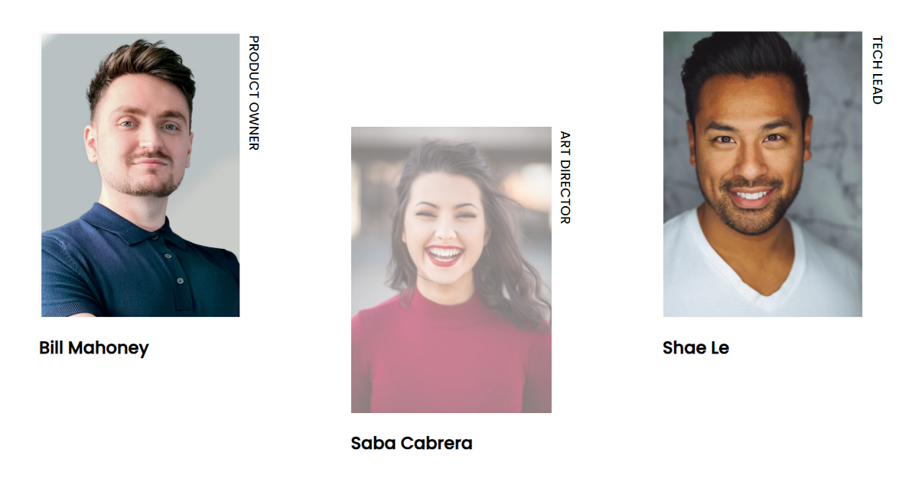

# Project My Team Page - Mobile First, Flexbox, Sass
PThis is the README file for the Responsive Design project, which utilizes Flexbox, Sass, and responsive design techniques.

## Table of contents

- [Overview](#overview)
  - [The challenge](#the-challenge)
  - [Screenshot](#screenshot)
- [My process](#my-process)
  - [Built with](#built-with)
  - [What I learned](#what-i-learned)
  - [Continued development](#continued-development)
  - [Useful resources](#useful-resources)
- [Author](#author)

## Overview
The Responsive Design project aims to create a web interface that adapts to different devices and screen sizes. Responsive design is employed to ensure that the page looks and functions correctly across various resolutions and orientations.

### The Challenge
The challenge is to design and build a responsive team web page that is flexible and automatically adjusts to different screen sizes, from mobile devices to desktop screens. Special attention should be given to user experience, ensuring that the page looks visually appealing and is easy to navigate. The project was developed with the following resolutions in mind:

* Mobile: 375px
* Desktop: 1440px

### Screenshot
Here is a screenshot of the project's interface:

***1.-Project web view***  

***2.-Project mobile view***

***3.-View making use of the hover event***

## My Process
The project development process was divided into several stages, described as follows:

**1.- Analysis and planning:** Prior research on responsive design was conducted to define the page's structure. The design was implemented using Flexbox and Sass techniques.

**2.- HTML structure creation:** The page's skeleton was developed using semantic HTML. Appropriate tags were used to organize the information logically and accessibly.

**3.- Styling with Sass:** Sass was used as a CSS preprocessor to facilitate style writing and maintenance. A Sass file was created to contain the page's components, and the BEM (Block Element Modifier) methodology was employed to maintain a modular and reusable style structure.

**4.- Application of Flexbox:** Flexbox was implemented to achieve a flexible and adaptable design. Flexbox properties such as display: flex, flex-direction, justify-content, and align-items were utilized to control the element arrangement on the page. Additionally, a hover event was added to adjust the opacity of an image when hovering over it.

**5.- Responsive design:** Responsive design techniques, including media queries and relative units, were applied to adapt the page to the specified screen sizes mentioned earlier. Tests were conducted on different devices and resolutions (375px, 1440px) to ensure the page appeared and functioned correctly on each one.

### Built With
This project was built using the following technologies:

* HTML
* CSS(Sass)
* Flexbox

### What I Learned
During the development of this project, I gained the following knowledge and skills:

* Implementation of responsive design using media queries and relative units.
* Usage of Flexbox to create flexible layouts and align elements.
* Application of Sass to write styles more efficiently and modularly.
* Improved understanding of the BEM methodology for an organized and reusable style structure.
* Testing and debugging across different devices and resolutions.

### Continued Development
The development of this project establishes a solid foundation for further exploration and improvement in the following areas:

* Advanced development of responsive interfaces.
* Incorporation of animation and interactive effects in responsive design.
* Optimization of performance and accessibility in responsive design.

### Useful Resources
During the project development, the following resources proved to be useful:

* [Flexbox documentation](https://css-tricks.com/snippets/css/a-guide-to-flexbox/)
* [Sass documentation](https://sass-lang.com/documentation/)
* [Responsive design guide](https://web.dev/responsive-web-design-basics/)

## Author
This project was created by Erick Fabian. 
You can reach me at [erickfabiandev.com](https://www.erickfabiandev.com/) for any inquiries or feedback.