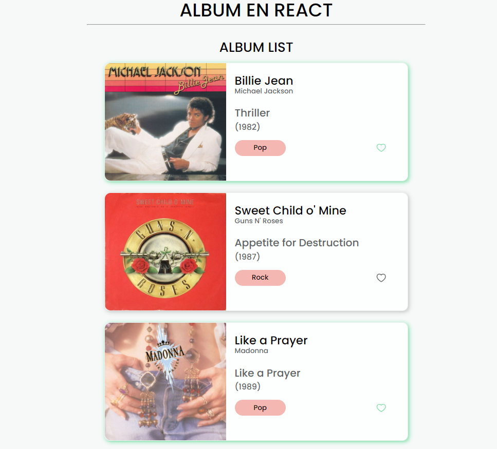

# Album en React

## Table of contents

- [Overview](#overview)
  - [Installation](#Installation)  
  - [The challenge](#the-challenge)
  - [Screenshot](#screenshot)
- [My process](#my-process)
  - [Built with](#built-with)
  - [What I learned](#what-i-learned)
  - [Continued development](#continued-development)
  - [Useful resources](#useful-resources)
- [Author](#author)

## Overview
This project is a React application that displays albums fetched from a data file (data.js). It consists of two components, the child component called Album, and the parent component called ListAlbum. The application allows users to click on a heart-shaped button to change the state of the album to "ME GUSTA" (liked) and applies a border to the Album component.

### Installation
Follow these steps to set up and run the project in your local environment:

1.  Clone this repository on your local machine or download it as a ZIP file.
     **git clone https://github.com/erickfabiandev/practiceExercise.git** 
2.  Navigate to the project directory.
     **cd Sprint_2/AlbumReact** 

3.  Install the project dependencies.
     **npm install**

### The Challenge
The challenge was to create a React application that could render a list of albums and allow users to interact with them by clicking on a heart button to toggle the "ME GUSTA" state and apply a visual indication on the Album component.

### Screenshot
Here is a screenshot of the project's interface:

***1.-Project web view ***

***2.-Project mobile view***

***3.-Functionality***

## My Process
When approaching this project, I followed these steps:

1. Set up the basic project structure with the necessary components and files.
2.  Created the Album component to display album information and handle the "ME GUSTA" state.
3.  Implemented the ListAlbum component to render a list of albums using the data from data.js.
4.  Added the functionality to toggle the "ME GUSTA" state and update the component's appearance when the heart button is clicked.
5.  Styled the components to achieve the desired visual representation.
6.  Tested the application to ensure proper functionality.

### Built With
This project was built using the following technologies:

* React
* CSS (BEM notation, pseudo-elements, flexbox)
* Vite

### What I Learned
During this project, I gained a deeper understanding of React and its component-based architecture. I learned how to manage state within components, handle user interactions, and update the UI accordingly. Additionally, I improved my CSS skills by styling the components to achieve the desired visual effects.

### Continued Development
In future projects, I would like to further enhance my skills in React and explore more advanced concepts such as state management libraries (e.g., Redux), routing, and integrating with backend APIs to create full-fledged web applications.

### Useful Resources
During the project development, the following resources proved to be useful:

* [React documentation](https://reactjs.org/docs) - An extensive resource for learning React and its various concepts and features.
* [MDN Web Docs](https://developer.mozilla.org) - A comprehensive documentation resource for HTML, CSS, and JavaScript.

## Author
This project was created by Erick Fabian. 
You can reach me at [erickfabiandev.com](https://erickfabiandev.com) for any inquiries or feedback.