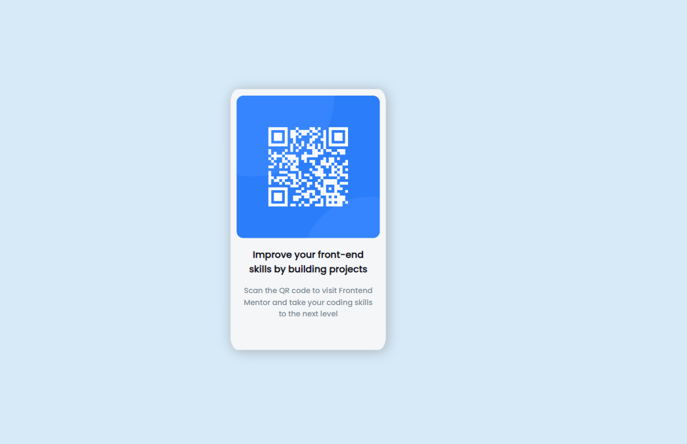
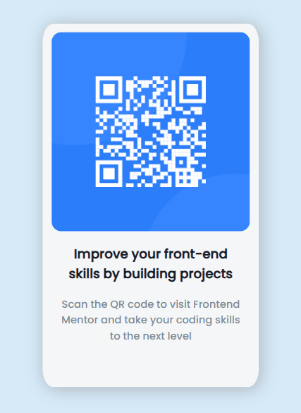

# Make It Real - QR Code Component
This a small project where I put my knowledge in react into practice has the following structure

## Table of contents

- [Overview](#overview)
  - [Installation](#Installation)  
  - [The challenge](#the-challenge)
  - [Screenshot](#screenshot)
- [My process](#my-process)
  - [Built with](#built-with)
  - [What I learned](#what-i-learned)
  - [Continued development](#continued-development)
  - [Useful resources](#useful-resources)
- [Author](#author)

## Overview
This project is a React component called "CodigoQr" that allows you to generate a custom QR code. The "CodigoQr" component is a child component of the "App" component and accepts the following props: "title", "subtitle", and "imageUrl". This component is designed to be responsive, with a layout optimized for screens with a width of 375px on mobile devices and 1440px on desktop devices.

### Installation
Follow these steps to set up and run the project in your local environment:

1.  Clone this repository on your local machine or download it as a ZIP file.
     git clone https://github.com/erickfabiandev/practiceExercise.git 
2.  Navigate to the project directory.
     cd Sprint_2/Make It Real - QR code component 

3.  Install the project dependencies.
     npm install 

### The Challenge
The main goal of this project is to create a reusable React component that generates a QR code with customization options. The component should receive props for "title", "subtitle", and "imageUrl" to display the corresponding information in the generated QR code.

### Screenshot
Here is a screenshot of the project's interface:

***1.-Project web view and mobile view***

***2.-Project mobile view***

## My Process
1.- I structured the HTML of the profile card using BEM notation to maintain a modular and reusable structure.
2.- I applied styles using CSS, utilizing flexbox to achieve a flexible and responsive layout.
3.- I used pseudo-elements (::before, ::after) to add additional details and decorative styles to the profile card.
4.- I implemented the button color change effect by applying specific styles for the hover state (:hover).
5.- I added styles to make the star ratings paint when the user hovers over them.
6.- I performed testing and adjustments to ensure the profile card looks good on different screen sizes and devices.

### Built With
This project was built using the following technologies:

* React
* CSS (BEM notation, pseudo-elements, flexbox)
* Vite

### What I Learned
During the development of this project, I learned how to create a React component and use props to customize its content. I also gained knowledge about generating QR codes and integrating third-party libraries into a React project.

### Continued Development
In the future, I would like to enhance this component by implementing more customization options, such as the ability to choose the QR code size or change the colors. I may also consider adding support for reading QR codes using the device's camera.

### Useful Resources
During the project development, the following resources proved to be useful:

* [React Documentation](https://legacy.reactjs.org/docs/getting-started.html) - This official React documentation is an excellent reference for learning and understanding the fundamental concepts of React.

## Author
This project was created by Erick Fabian. 
You can reach me at [erickfabiandev.com](https://erickfabiandev.com) for any inquiries or feedback.
