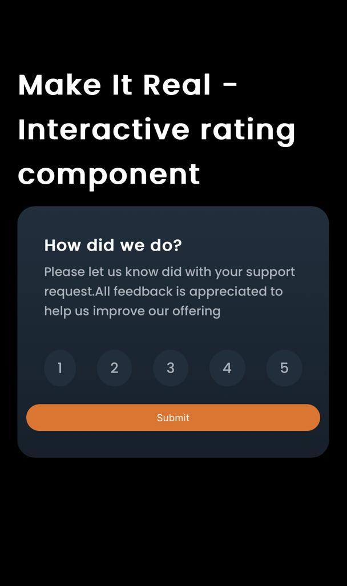

# Interactive Rating Component
This project aims to design an interactive rating component that allows users to select a rating and display the result in a modal. The component is built using React for the logic and SASS for styling.

## Table of contents

- [Overview](#overview)
  - [Installation](#Installation)  
  - [The challenge](#the-challenge)
  - [Screenshot](#screenshot)
- [My process](#my-process)
  - [Built with](#built-with)
  - [What I learned](#what-i-learned)
  - [Continued development](#continued-development)
  - [Useful resources](#useful-resources)
- [Author](#author)

## Overview
The goal of this project is to create an interactive rating component that provides users with an easy way to select a rating and view the result in a modal. The component should be user-friendly and intuitive, delivering a pleasant user experience.

### Installation
Follow these steps to set up and run the project in your local environment:

1.  Clone this repository on your local machine or download it as a ZIP file.
     **git clone https://github.com/erickfabiandev/practiceExercise.git** 
2.  Navigate to the project directory.
     **cd Sprint_2/AlbumReact** 

3.  Install the project dependencies.
     **npm install**

### The Challenge
The main challenge of this project is to create an interactive rating component that allows users to select a rating and display the result in a modal. Some key aspects to consider are:

* Designing an attractive and user-friendly interface for the rating component.
* Implementing the logic to capture the rating selected by the user.
* Displaying the rating result in a modal in a clear and readable manner.
* Ensuring that the component is responsive and functions correctly across different devices and screen sizes.

### Screenshot
Here is a screenshot of the project's interface:

***1.-Project web view***

***2.-Project mobile view***

***3.-Functionality***

## My Process
During the development of this project, I used the following technologies and approaches:

### Built With
This project was built using the following technologies:

* React: I used React as the main library for building the interactive rating component.
* SASS: I used SASS as a CSS preprocessor to write more efficient and reusable styles.

### What I Learned
During the development of this project, I learned how to:

* Create reusable and modular components in React.
* Use SASS to write more advanced and structured styles.
* Implement a modal in React using.

### Continued Development
Although the interactive rating component is functional, there are areas where I would like to continue working on:

* Improve the accessibility of the component to ensure an optimal experience for all users.
* Optimize the performance of the component, especially when it comes to state updates and re-renders.
* Add more customization options to the component, such as changing the number of stars or the modal text.

### Useful Resources
During the project development, the following resources proved to be useful:

* [React documentation](https://reactjs.org/docs) - An extensive resource for learning React and its various concepts and features.
* [Official SASS documentation](https://sass-lang.com/documentation)
* [MDN Web Docs](https://developer.mozilla.org) - A comprehensive documentation resource for HTML, CSS, and JavaScript.

## Author
This project was created by Erick Fabian. 
You can reach me at [erickfabiandev.com](https://erickfabiandev.com) for any inquiries or feedback.
